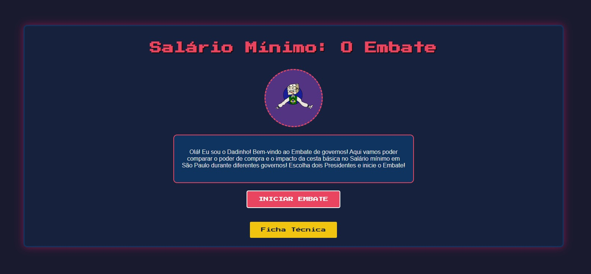
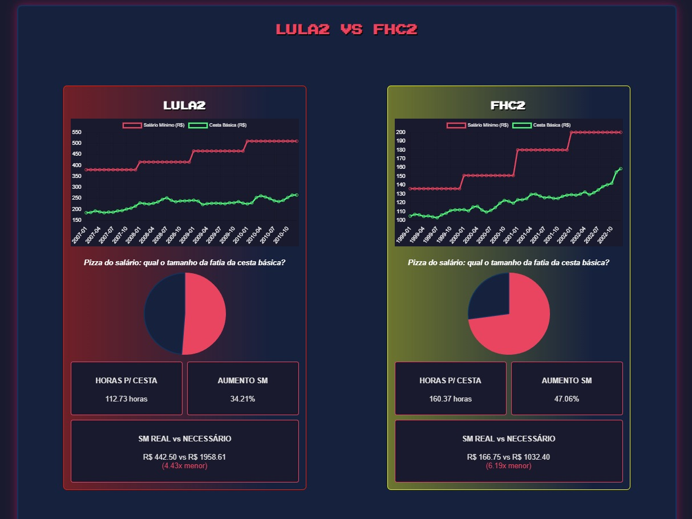
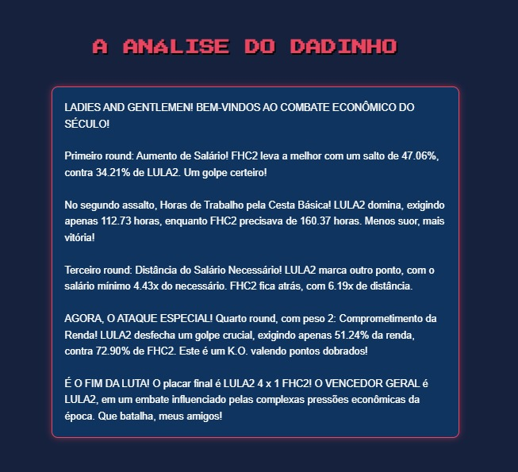

# 🥊 Salário Mínimo: O Embate (TCC Nota Máxima)


## 📝 Sobre o Projeto

Este projeto é uma análise de dados profunda sobre o **impacto da cesta básica no salário mínimo no Brasil**, desenvolvida como Trabalho de Conclusão de Curso (TCC) e avaliada com **nota máxima**.

A aplicação utiliza uma abordagem gamificada ("estilo jogo de luta Retrô") para comparar diferentes períodos governamentais, analisando o poder de compra real da população através de métricas econômicas robustas, processadas com Python e Pandas, e interpretadas por inteligência artificial (Google Gemini).

## 📊 Principais Insights

Abaixo, alguns dos resultados gerados pela análise:

| **Interface de Início** | **Seleção de Governos** |
|:---:|:---:|
|  |  |
| *O personagem "Dadinho" guia o usuário pela análise.* | *Comparação direta entre diferentes gestões presidenciais.* |

### 📈 Painel Analítico de Resultados
Aqui vemos a evolução do salário mínimo (linha vermelha) vs. o custo da cesta básica (linha verde) e o comprometimento da renda (gráfico de pizza).



### 🤖 Análise por Inteligência Artificial
Ao final de cada "embate", o **Google Gemini** atua como narrador ("Dadinho"), fornecendo um veredito técnico e carismático sobre qual governo proporcionou o melhor cenário econômico.



---

## 🛠️ Pré-requisitos

- Python 3.8 ou superior
- Git instalado
- Uma chave de API do [Google AI Studio](https://aistudio.google.com/app/apikey)

## 🚀 Instalação e Configuração

1. **Clone o repositório:**
   ```bash
    git clone https://github.com/LilLemo/Analise-cesta-basica-salario-minimo.git
    cd Analise-cesta-basica-salario-minimo
   ```

2. **Crie e ative o ambiente virtual:**
   ```bash
   # Windows
   python -m venv venv
   .\venv\Scripts\activate

   # Linux/Mac
   python3 -m venv venv
   source venv/bin/activate
   ```

3. **Instale as dependências:**
   ```bash
   pip install -r requirements.txt
   ```

4. **Configuração de Variáveis de Ambiente (CRÍTICO):**
   Crie um arquivo `.env` na raiz do projeto baseado no `.env.example`:
   ```bash
   cp .env.example .env
   ```
   Abra o arquivo `.env` e insira sua chave da API do Gemini:
   `GEMINI_API_KEY=SUA_CHAVE_AQUI`

---

## 💻 Como Executar

Para iniciar o servidor local e rodar a interface web:
```bash
python servidor_ia.py
```
Acesse no seu navegador: `http://localhost:5000`

---

## 📁 Estrutura do Projeto

```text
├── venv/                   # Ambiente virtual (Ignorado no Git)
├── resultados/             # Gráficos e dados JSON gerados
├── static/                 # Arquivos frontend (HTML, CSS, JS)
├── .env                    # Variáveis sensíveis (Ignorado no Git)
├── .env.example            # Template de exemplo para variáveis
├── .gitignore              # Filtro de arquivos para o repositório
├── analisador_completo.py  # Script de processamento de dados e Matplotlib
├── dados_analiticos.db     # Banco de dados SQLite
├── requirements.txt        # Dependências do projeto
├── servidor_ia.py          # Backend em Flask com integração Gemini
└── README.md               # Documentação do projeto
```

---
*Desenvolvido por [Seu Nome] - 2024*
